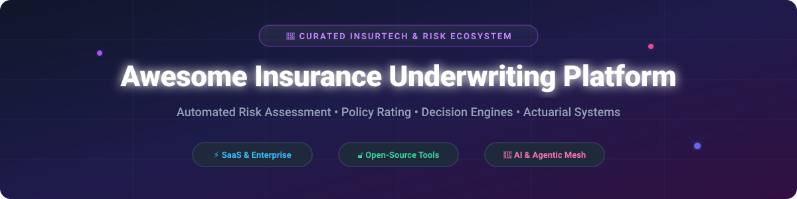

  

# 🛡️ Awesome Insurance Underwriting Platform 🚀

> **Curated List of Insurance Underwriting Platforms, Actuarial Decision Engines, Policy Rating Frameworks & Risk Assessment Systems**  
> *A comprehensive guide to SaaS platforms and open-source projects for commercial, personal, health, and specialty insurance underwriting automation.*

---

## 📌 Overview & SEO Keywords

The global **Insurance Underwriting Software Sector** is estimated at **$4.8 Billion in 2026** and growing at **11.5% CAGR**, transitioning from legacy core policy administration systems to modular, AI-driven rating engines and automated underwriting workbenches. The market exhibits **moderate fragmentation**, with legacy suite providers (e.g., Guidewire, Duck Creek) holding core record-keeping systems while innovative AI-native SaaS startups (e.g., Cytora, Artificial Labs, Send Technology) capture automated submission, triage, and risk assessment workloads.

This repository tracks top-tier **SaaS underwriting platforms**, **actuarial rating engines**, **Drools-based decision engines**, and **agentic AI risk frameworks** for insurers, MGAs, brokers, and insurtech developers.

---

## 💡 Table of Contents
- [🏢 SaaS & Enterprise Underwriting Platforms](#-saas--enterprise-underwriting-platforms)
- [🔓 Open-Source GitHub Projects](#-open-source-github-projects)
- [🤝 How to Contribute](#-how-to-contribute)
- [💖 Support](#-support)
- [📈 Star History](#-star-history)
- [⚠️ Disclaimer](#%EF%B8%8F-disclaimer)

---

## 🏢 SaaS & Enterprise Underwriting Platforms

> **Market Structure Note**: *The sector features a mix of multi-billion dollar core insurance suite vendors and specialized venture-backed underwriting workbenches.*

| Platform Name | Key Features & Underwriting Capabilities | Valuation / Company Scale | Starting Pricing Tier | Free Tier / Trial Limit |
| :--- | :--- | :--- | :--- | :--- |
| **Guidewire Underwriting** | Submission intake, policy rating, quote generation, and risk assessment module inside Guidewire InsuranceSuite. | **$12.0 Billion** (Public: NYSE: GWRE) | Custom Enterprise Quote ($100k+/yr) | Demo / Sandbox on Request (No public free trial) |
| **Duck Creek Underwriting** | Underwriting module for P&C insurers with automated rating rules, risk triage, and commercial line workflows. | **$2.6 Billion** (Acquired by Vista Equity) | Enterprise SaaS Licensing | Demo on Request (No public free trial) |
| **Sapiens Underwriting** | Risk decisioning, dynamic policy rating, and automated quote-to-issue workflows across P&C, Life, and Health. | **$2.5 Billion** (Acquired by Advent International) | Enterprise Custom Plan | Product Demo on Request |
| **Majesco Underwriting** | Cloud underwriting management integrated with Majesco Policy; handles automated rating, quote, and risk rules. | **$300M+ Annual Revenue** (Thoma Bravo portfolio) | Enterprise Custom Quote | Demo / Sandbox on Request |
| **EIS Underwriting** | Cloud-native, API-first underwriting and policy engine within EIS OneSuite for Life, Health, and P&C lines. | **$162M+ Raised / $150M+ Rev Est.** (TPG backed) | Enterprise Tier Quote | Guided Sandbox Demo |
| **Socotra** | Cloud-native, API-first core platform with flexible rating, underwriting rule engines, and agentic AI integrations. | **$83M+ Raised** (Venture Backed) | Paid Enterprise Plan | API Developer Sandbox Access |
| **INSTANDA** | No-code insurance product design & underwriting engine enabling rapid launch of custom rating models and portals. | **$85M+ Raised** (CommerzVentures backed) | Custom Enterprise Subscription | Demo & POC Sandbox on Request |
| **Artificial Labs** | Algorithmic underwriting & digital contract platform for commercial and specialty insurance risk placement. | **$67M+ Raised** (Series B, $45M in 2026) | Custom SaaS Subscription | Book-a-Demo / Pilot Program |
| **Send Technology** | AI-native underwriting workbench for risk submission triage, policy rating, and automated decision orchestration. | **Acquired by Duck Creek / £10M-£50M Rev** | Enterprise SaaS Pricing | Book-a-Demo / Pilot Trial |
| **Cytora** | Generative & agentic AI risk-processing platform digitizing unstructured submissions for commercial underwriting. | **Acquired by Applied Systems / $10.6M Rev** | Enterprise Custom Tier | Book-a-Demo / Enterprise Pilot |

---

## 🔓 Open-Source GitHub Projects

Curated open-source projects for self-hosting, transparent actuarial modeling, rule-based rating engines, and agentic risk evaluation.

| Project Name | Stars & Links | Key Underwriting & Actuarial Features | Tech Stack |
| :--- | :--- | :--- | :--- |
| **AWS Agentic Claims & Risk** |  | Production-grade autonomous agentic mesh for claims processing, risk evaluation, and loss ratio analytics. | Python, EKS, AWS Bedrock |
| **Insolver** |  | Low-code actuarial risk classification, GLM/GAM tariff construction, and machine learning scoring for insurance pricing. | Python, Machine Learning |
| **AWS GenAI Underwriting** |  | Generative AI underwriting workbench transforming submission analysis and risk extraction workflows. | Python, React, Bedrock |
| **openIMIS** |  | Digital Public Good for social health insurance administration, eligibility evaluation, and medical review. | Python, Django, HL7 FHIR |
| **Usage-Based Insurance Engine** |  | Digital underwriting engine for connected vehicle telemetry and real-time usage-based premium calculation. | Node.js, MongoDB |
| **Agentic Rules Engine** |  | Natural language business rules engine alternative to Drools tailored for automated insurance underwriting policies. | Java, Spring Boot, LLM |
| **Rules-Engine (Underwriter)** | ⚙️ Open Source | Multi-domain Java underwriting engine (auto, life, mortgage, travel) with client-specific rule sets. | Java, Spring Boot, Drools |
| **ratingtables** | 📊 Actuarial CRAN | Table-driven insurance rating engine executing ordered factor specifications against pricing tables. | R, CRAN Package |
| **insurancerating** | 📈 Actuarial Model | Actuarial risk classification & tariff construction with GAM modeling and evolutionary tree binning. | R |
| **AI Underwriting System** | ⚡ Full-Stack | Enterprise Node.js system with 60+ API endpoints, 9 workflow node types, and sub-500ms execution. | TypeScript, React, PostgreSQL |
| **Insurance Agentic Mesh** | 🤖 Agent Framework | Dedicated Underwriting Server using MCP/A2A protocols for coverage eligibility and premium calculations. | Java, Spring Boot, JSON-RPC |
| **@zanii/insurance** | 🔐 Ledger Risk | Machine-verifiable underwriting generating risk profiles from ledger facts and Merkle-proven receipts. | TypeScript, Python |
| **MediPolicy_IQ** | 🏥 Health Engine | Healthcare underwriting engine with explainable AI fraud detection and OCR invoice extraction. | FastAPI, Streamlit, Python |

---

## 🤝 How to Contribute

Contributions are highly encouraged! To add a new platform or open-source tool:
1. Fork this repository.
2. Edit [`README.md`](file:///C:/Users/ishan/Documents/Projects/Awesome-Insurance-Underwriting-Platform/README.md) adding your tool under the appropriate section.
3. Ensure description includes key features, tech stack, and license/pricing info.
4. Open a Pull Request with a short explanation.

Check out [Awesome-Awesome-Awesome](https://github.com/ishandutta2007/Awesome-Awesome-Awesome) for more curated lists!

---

## 💖 Support

Thank you for visiting and using this repository! If you find this curated list of insurance underwriting platforms and actuarial tools helpful, please consider supporting the project:

- ⭐️ **Star this repository** to help others discover it!
- 🔀 **Fork & Share** it with colleagues, actuaries, and insurtech developers.
- ☕️ **Buy me a coffee**: Support ongoing maintenance and curated updates via the [GitHub Sponsor Dashboard](https://github.com/sponsors/ishandutta2007).

---

## 📈 Star History

---

## ⚠️ Disclaimer

*This list is community-curated for research and informational purposes. Insurance underwriting platforms handle regulated financial data; implementations must comply with regional insurance regulatory frameworks (e.g., Solvency II, NAIC, GDPR).*
